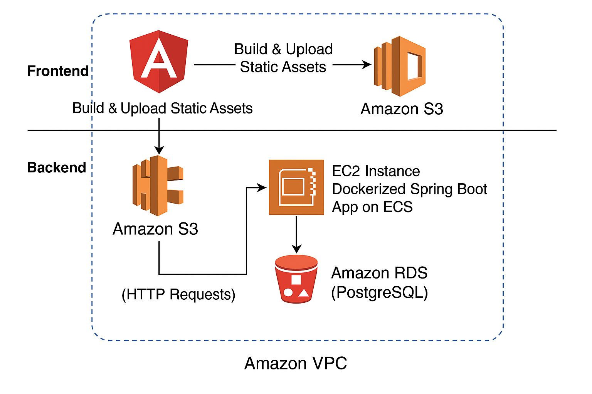
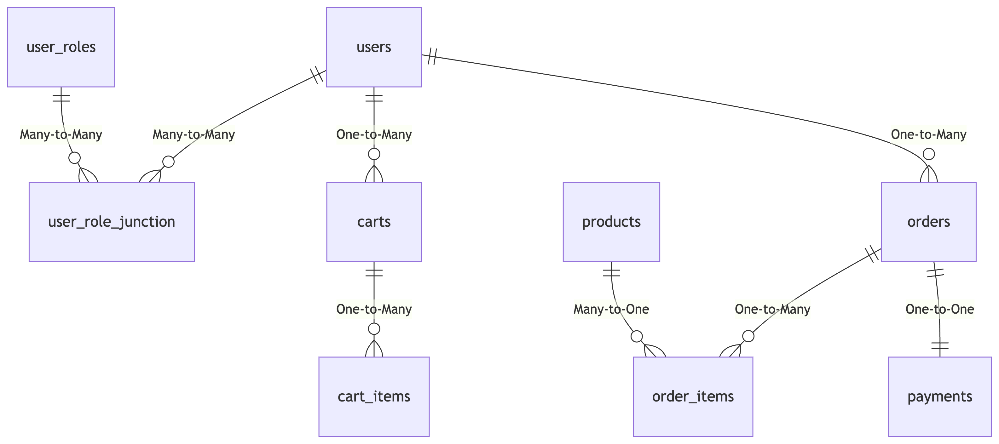
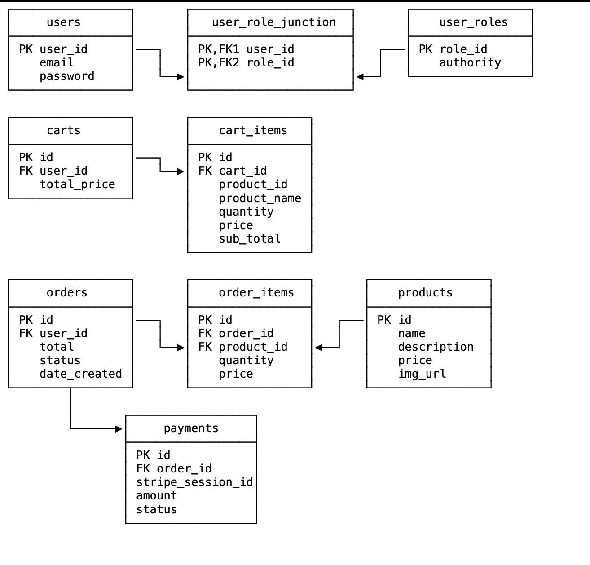

# 🛒 eCommerce Web Application on AWS

> A full-stack cloud-native eCommerce platform built with Angular, Spring Boot, PostgreSQL, and deployed using AWS services including S3, ECS, EC2, RDS, and VPC.

---

## 🌟 Project Overview

This project demonstrates how to design, build, and deploy a scalable full-stack eCommerce web application using AWS services. Users can:

- Register/login (JWT-secured)
- Browse products
- Add items to a cart
- Place orders
- Make payments (Stripe integrated)

---

## 🔧 Technologies Used

| Layer       | Technology                             |
|-------------|----------------------------------------|
| Frontend    | Angular 16 SPA                         |
| Backend     | Spring Boot + REST API + JWT           |
| Database    | PostgreSQL (AWS RDS)                   |
| Container   | Docker + AWS ECR                       |
| Cloud       | AWS S3, ECS (EC2 Launch Type), RDS, VPC|
| Payments    | Stripe API                             |
| Deployment  | Manual via AWS Console + AWS CLI       |

---

## ⚙️ Architecture Diagram

Below is the cloud architecture showing how different AWS services integrate with the application:



> **Note:** Frontend is hosted on S3, backend runs as a Dockerized ECS Task on EC2, and data is stored in PostgreSQL via Amazon RDS. The environment is wrapped inside a custom Amazon VPC.

---

## 🗃️ Database Schema

The application uses a normalized PostgreSQL schema. Here's the logical view:

### Entity-Relationship Model (ER Diagram)



### Table-Level Schema



> Entities include: `users`, `products`, `carts`, `orders`, `payments`, with proper foreign keys and constraints.

---

## 📂 Project Structure

```
ecommerce-project/
│
├── frontend/               # Angular application
│   └── src/
│
├── backend/                # Spring Boot backend
│   └── src/
│
├── docker/                 # Dockerfiles and ECS configs
│
├── docs/                   # Diagrams and images
│   ├── architecture.png
│   ├── schema.png
│   └── ERDiagram.png
└── README.md
```

---

## ☁️ AWS Deployment Workflow

### Frontend (Angular) → Amazon S3

```bash
ng build --prod
aws s3 sync dist/your-app-name s3://your-bucket-name --acl public-read
```

- Hosted as a static website
- Bucket policy and CORS configured for public access

### Backend (Spring Boot) → ECS via ECR

```bash
docker build -t ecommerce-backend .
docker tag ecommerce-backend <aws_id>.dkr.ecr.us-east-1.amazonaws.com/ecommerce-backend
aws ecr get-login-password | docker login --username AWS --password-stdin ...
docker push <aws_id>.dkr.ecr.us-east-1.amazonaws.com/ecommerce-backend
```

- Task definition includes ENV variables like `DB_PASSWORD`, `JWT_SECRET`
- ECS Task runs on EC2 in public subnet

### Database → Amazon RDS (PostgreSQL)

- Setup with private subnets
- Port 5432 open only to ECS Security Group
- Initialized manually using `psql` via SSH EC2 instance

---

## 🔐 Environment Variables (Set in ECS)

| Variable         | Description                        |
|------------------|------------------------------------|
| DB_URL           | RDS endpoint URL                   |
| DB_USERNAME      | RDS user                           |
| DB_PASSWORD      | RDS password                       |
| JWT_SECRET       | Secret key for token signing       |
| STRIPE_API_KEY   | Used to initiate payments          |

---

## 📈 Features at a Glance

- 🧾 **Authentication:** JWT-secured login with role-based access
- 🛒 **Shopping Cart:** Live total calculations and quantity controls
- 📦 **Order Management:** View past orders
- 💳 **Payments:** Integrated Stripe Checkout
- 🛠️ **Admin Mode:** Add/remove products (secured by role)

---

## 📚 References

- [AWS S3 Documentation](https://docs.aws.amazon.com/s3/)
- [AWS ECS (EC2 Launch Type)](https://docs.aws.amazon.com/ecs/latest/developerguide/Welcome.html)
- [AWS RDS PostgreSQL](https://docs.aws.amazon.com/AmazonRDS/latest/UserGuide/CHAP_PostgreSQL.html)
- [Spring Boot Docs](https://spring.io/projects/spring-boot)
- [Stripe API Docs](https://stripe.com/docs/api)

---

## 📌 How to Run Locally

### Frontend
```bash
cd frontend
npm install
ng serve
```

### Backend
```bash
cd backend
mvn clean package
java -jar target/*.jar
```

---

